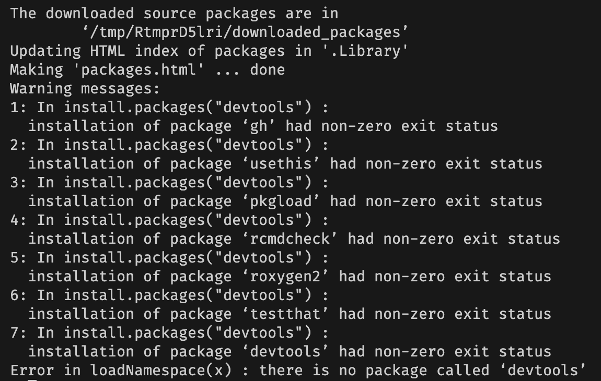

# scDesign3-reproduce
在 scRNA-seq 上复现 scDesign3 效果
# setup env

```
conda create -n r-scdesign r-base r-essentials
# install scDesign3
R
if (!require("devtools", quietly = TRUE))
    install.packages("devtools")
devtools::install_github("SONGDONGYUAN1994/scDesign3")
```

### env error fix


change the order to install packages, it works just well.

1. install devtools first
```
install.packages("devtools")
```

2. install scDesign3

```
# choose skip updates, takes very looong time to install :(
devtools::install_github("SONGDONGYUAN1994/scDesign3")
```

and it output 
```
ERROR: dependency ‘rvinecopulib’ is not available for package ‘scDesign3’
```
then run

```
install.packages("rvinecopulib")
```

re-run the command
```
devtools::install_github("SONGDONGYUAN1994/scDesign3")
```

env set ready.
